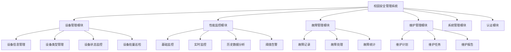
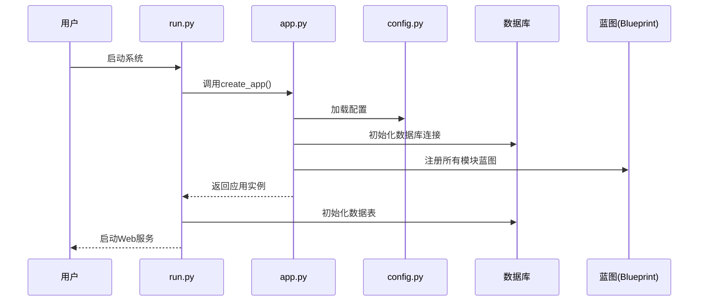
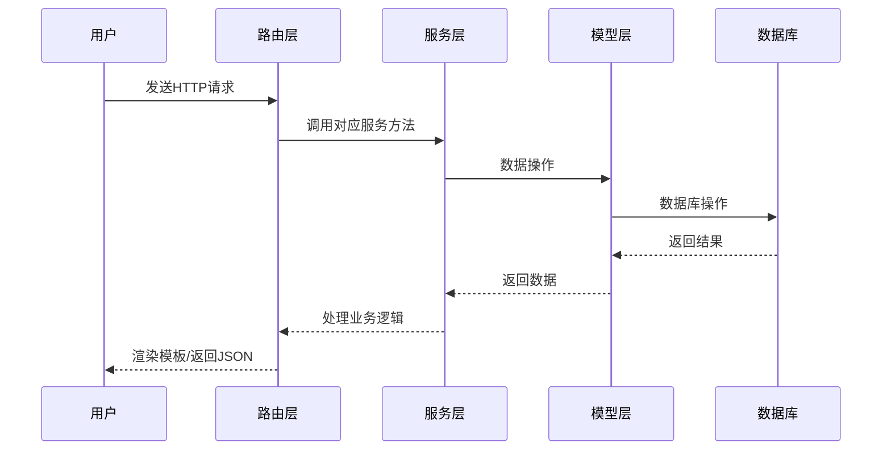
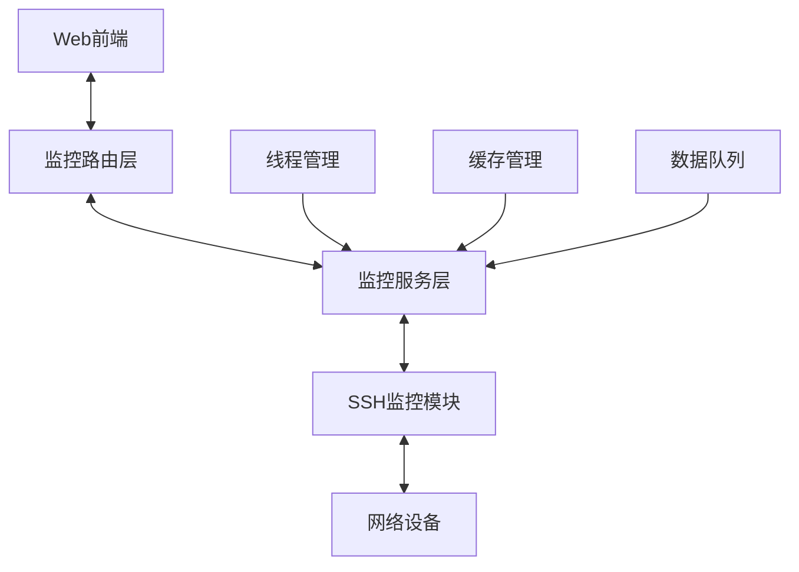
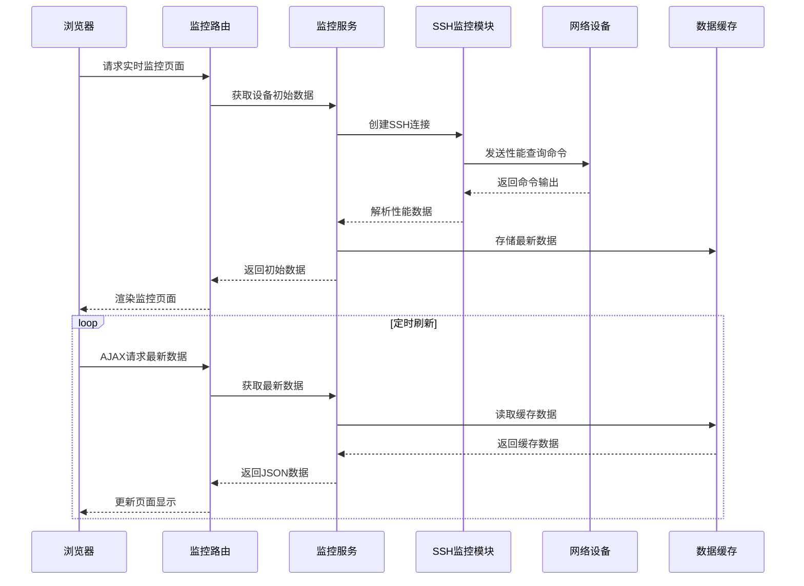
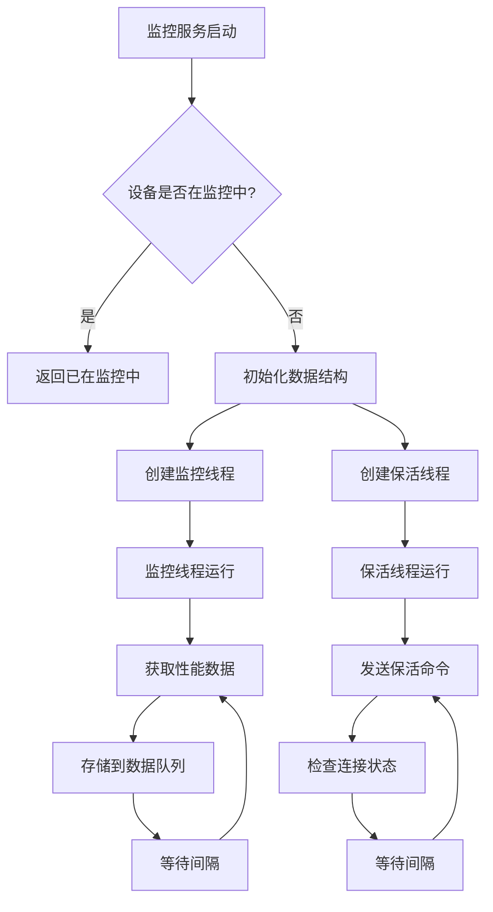
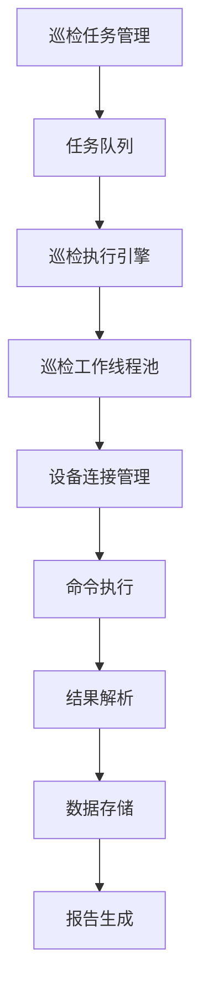
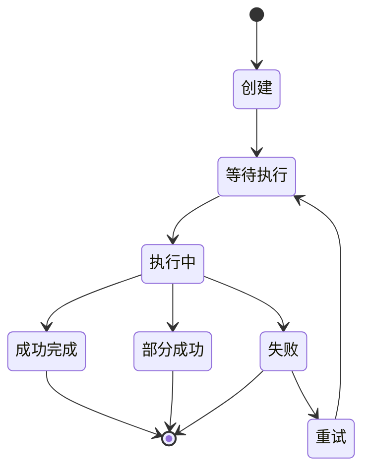
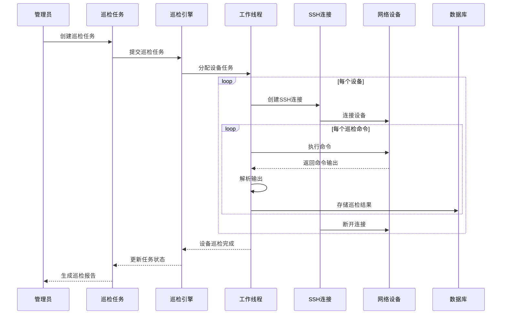
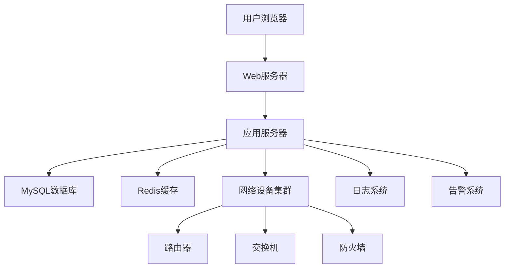

# 校园安全管理系统(CSMS)架构详解

## 一、系统整体架构

### 1. 分层架构

```
┌─────────────────────────────────────────────────────────────┐
│                        表现层(Presentation Layer)            │
│  ┌──────────┐ ┌──────────┐ ┌──────────┐ ┌────────────────┐  │
│  │ 设备管理  │ │ 性能监控  │ │ 故障管理  │ │  维护任务管理   │  │
│  └──────────┘ └──────────┘ └──────────┘ └────────────────┘  │
├─────────────────────────────────────────────────────────────┤
│                        业务逻辑层(Business Layer)            │
│  ┌──────────┐ ┌──────────┐ ┌──────────┐ ┌────────────────┐  │
│  │设备服务   │ │监控服务   │ │故障服务  │ │  维护服务      │  │
│  └──────────┘ └──────────┘ └──────────┘ └────────────────┘  │
├─────────────────────────────────────────────────────────────┤
│                        数据访问层(Data Access Layer)         │
│  ┌──────────┐ ┌──────────┐ ┌──────────┐ ┌────────────────┐  │
│  │设备模型   │ │性能模型   │ │故障模型  │ │  维护模型      │  │
│  └──────────┘ └──────────┘ └──────────┘ └────────────────┘  │
├─────────────────────────────────────────────────────────────┤
│                        基础设施层(Infrastructure Layer)      │
│  ┌──────────┐ ┌──────────┐ ┌──────────┐ ┌────────────────┐  │
│  │数据库     │ │网络协议   │ │缓存      │ │  日志/认证     │  │
│  └──────────┘ └──────────┘ └──────────┘ └────────────────┘  │
└─────────────────────────────────────────────────────────────┘
```

### 2. 模块组织架构



## 二、代码结构组织

```
src/
├── app.py                 # 应用入口
├── config.py              # 配置文件
├── db.py                  # 数据库连接
├── models/                # 数据模型
│   ├── __init__.py        
│   ├── device.py          # 设备相关模型
│   └── performance.py     # 性能相关模型
├── modules/               # 功能模块
│   ├── auth/              # 认证模块
│   ├── device/            # 设备管理模块
│   │   ├── __init__.py     
│   │   ├── routes.py      # 路由
│   │   └── services.py    # 业务逻辑
│   ├── fault/             # 故障管理模块
│   ├── maintenance/       # 维护管理模块
│   └── performance/       # 性能监控模块
│       ├── __init__.py
│       ├── routes.py              # 路由定义
│       ├── services.py            # 业务服务
│       ├── enhanced_ssh_monitor.py # SSH监控实现
│       ├── enhanced_monitor_service.py # 增强监控服务
│       └── realtime_monitor.py    # 实时监控
├── core/                  # 核心功能
│   ├── __init__.py
│   └── auth.py            # 认证逻辑
├── static/                # 静态资源
└── templates/             # HTML模板
```

## 三、系统核心流程

### 1. 系统初始化流程



### 2. 用户请求处理流程



## 四、实时监控技术实现

### 1. 实时监控架构



### 2. 实时监控核心类图

```
+------------------------+     +------------------------+
|  EnhancedMonitorService|     |   EnhancedSSHMonitor   |
|------------------------|     |------------------------|
| +start_device_monitoring     | +get_connection()      |
| +stop_device_monitoring      | +get_cpu_usage()       |
| +get_latest_data()           | +get_memory_usage()    |
| +get_history_data()          | +get_uptime()          |
| +execute_command()           | +get_interface_stats() |
| -_monitor_device_thread()    | +collect_device_data() |
| -_keepalive_thread()         | +close_connection()    |
+------------+---------------+  +------------------------+
             |                      ^
             v                      |
+------------------------+          |
|     RealTimeMonitor    |-----------
|------------------------|
| +get_latest_data()     |
| +get_history_data()    |
| +start_device_monitoring|
| +stop_device_monitoring |
+------------------------+
```

### 3. 实时监控数据流程



### 4. 多线程监控机制



## 五、批量网络设备巡检技术实现

### 1. 批量巡检架构



### 2. 巡检任务状态图



### 3. 巡检核心流程



## 六、关键技术实现细节

### 1. SSH连接与命令执行

```python
def get_connection(device_id, ip, username, password, port=22, vendor="huawei"):
    # 创建连接锁
    if device_id not in connection_locks:
        connection_locks[device_id] = threading.Lock()
    
    with connection_locks[device_id]:
        # 检查连接是否存在且有效
        if device_id in device_connections and device_connections[device_id] is not None:
            try:
                # 测试连接有效性
                device_connections[device_id].find_prompt()
                return device_connections[device_id]
            except Exception:
                # 连接失效，重新连接
                pass
        
        # 创建新连接
        device_info = {
            'device_type': VENDOR_MAP[vendor]["device_type"],
            'ip': ip,
            'username': username,
            'password': password,
            'port': port,
            'timeout': 10,
            'session_timeout': 60,
            'keepalive': 30
        }
        
        # 使用netmiko创建连接
        conn = ConnectHandler(**device_info)
        device_connections[device_id] = conn
        
        return conn
```

### 2. 多线程数据采集

```python
def _monitor_device_thread(device_id):
    """监控线程函数，负责定期采集设备性能数据"""
    device = Device.query.get(device_id)
    if not device:
        return
    
    while not monitor_stop_flags.get(device_id, True):
        try:
            # 获取设备连接
            conn = get_connection(
                device_id, 
                device.ip_address, 
                device.username, 
                device.password,
                device.port
            )
            
            # 采集性能数据
            cpu_usage = get_cpu_usage(device_id, conn)
            memory_usage = get_memory_usage(device_id, conn)
            uptime = get_uptime(device_id, conn)
            interfaces = get_interface_stats(device_id, conn)
            
            # 计算总带宽使用率
            bandwidth_usage = calculate_bandwidth_usage(interfaces)
            
            # 更新最新数据
            latest_device_data[device_id] = {
                "cpu_usage": cpu_usage,
                "memory_usage": memory_usage,
                "bandwidth_usage": bandwidth_usage,
                "uptime": uptime,
                "timestamp": time.time(),
                "interfaces": interfaces
            }
            
            # 存储到数据队列
            if device_id in device_performance_data:
                if device_performance_data[device_id].full():
                    device_performance_data[device_id].get()
                device_performance_data[device_id].put(latest_device_data[device_id])
            
            # 保存到数据库
            save_performance_data(device_id, latest_device_data[device_id])
            
        except Exception as e:
            logger.error(f"监控设备 {device_id} 数据采集失败: {str(e)}")
            
        # 等待采集间隔
        time.sleep(COLLECTION_INTERVAL)
```

### 3. 设备批量巡检实现

```python
def execute_inspection(inspection_task_id):
    """执行批量巡检任务"""
    task = InspectionTask.query.get(inspection_task_id)
    if not task:
        return {"status": "error", "message": "任务不存在"}
    
    # 更新任务状态
    task.status = "running"
    task.start_time = datetime.now()
    db.session.commit()
    
    # 获取要巡检的设备列表
    if task.device_group_id:
        devices = Device.query.filter_by(group_id=task.device_group_id).all()
    else:
        devices = Device.query.filter(Device.id.in_(task.device_ids.split(','))).all()
    
    # 获取巡检命令列表
    inspection_commands = task.commands.split("\n") if task.commands else []
    
    # 创建工作线程池
    with ThreadPoolExecutor(max_workers=task.max_workers or 5) as executor:
        # 提交设备巡检任务
        future_to_device = {
            executor.submit(inspect_device, device, inspection_commands, task): device
            for device in devices
        }
        
        # 处理结果
        for future in as_completed(future_to_device):
            device = future_to_device[future]
            try:
                result = future.result()
                # 保存设备巡检结果
                report = InspectionReport(
                    task_id=task.id,
                    device_id=device.id,
                    status=result["status"],
                    result=json.dumps(result["data"]),
                    error_message=result.get("message", "")
                )
                db.session.add(report)
                db.session.commit()
            except Exception as e:
                logger.error(f"处理设备 {device.id} 巡检结果失败: {str(e)}")
    
    # 更新任务状态
    task.status = "completed"
    task.end_time = datetime.now()
    db.session.commit()
    
    # 生成巡检报告
    generate_inspection_report(task.id)
    
    return {"status": "success", "message": "巡检任务已完成"}
```

## 七、系统关键特性

1. **分层架构**: 严格的MVC分层，确保代码的可维护性和可扩展性
2. **模块化设计**: 按功能模块拆分，每个模块独立可维护
3. **多线程处理**: 使用线程池技术实现并发设备监控和巡检
4. **实时数据采集**: 基于SSH的网络设备实时性能数据采集
5. **硬件加速**: 使用缓存队列和数据缓存提高性能
6. **设备厂商适配**: 支持多厂商设备(华为、思科等)的命令差异
7. **优雅降级**: 在无法获取真实数据时使用模拟数据
8. **安全连接管理**: 连接池和保活机制确保设备连接的可靠性
9. **可视化展示**: 使用前端图表技术直观展示性能数据
10. **批量任务处理**: 支持自定义命令的批量设备巡检

## 八、系统部署架构



校园安全管理系统通过精心设计的架构，实现了网络设备的集中管理、实时监控和批量巡检，为校园网络安全提供了全面的技术支持。系统的核心技术亮点在于通过多线程和SSH通信实现对大量网络设备的实时监控，以及通过工作线程池实现的高效批量巡检机制。 

@device_bp.route('/delete/<int:device_id>', methods=['POST'])
@login_required
def delete(device_id):
    try:
        # 直接使用SQL语句删除设备及相关记录
        # 首先删除外键引用
        db.session.execute(f"DELETE FROM performance_data WHERE device_id = {device_id}")
        db.session.execute(f"DELETE FROM performance_records WHERE device_id = {device_id}")
        db.session.execute(f"DELETE FROM thresholds WHERE device_id = {device_id}")
        # 最后删除设备记录
        db.session.execute(f"DELETE FROM devices WHERE id = {device_id}")
        db.session.commit()
        
        flash('设备已删除', 'success')
    except Exception as e:
        db.session.rollback()
        flash(f'删除设备失败: {str(e)}', 'danger')
    
    return redirect(url_for('device.index')) 